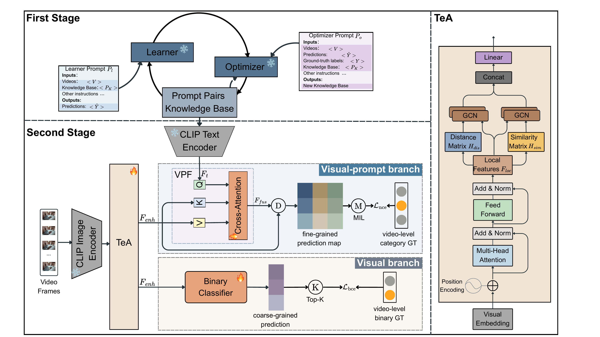

# VPTeA-VAD

## Verbalized Prompts and Multi-Scale Temporal Adapters for Video Anomaly Detection

VPTeA-VAD is a two-stage vision-language framework for weakly supervised video anomaly detection (WSVAD). The method is trained with video-level labels, decouples anomaly semantic definition from temporal feature optimization, and supports both video-level coarse-grained detection and frame-level fine-grained localization.

## Paper Information

- Paper title: VPTeA-VAD: Verbalized Prompts and Multi-Scale Temporal Adapters for Video Anomaly Detection
- Authors: Xin Gao, Tianlun Pan, Yuxuan Zhao

The central challenge is that video-level supervision alone does not clearly define the semantic or temporal boundaries of anomalous events. VPTeA-VAD describes normal and abnormal behaviors with a language knowledge base, then performs detection with multi-scale temporal modeling and cross-modal alignment.

## Method Overview

Click the figure below to open the original PDF method diagram:

[](img/VPTeAv2.pdf)

### Stage 1: Verbalized Learning

The first stage follows the verbalized learning paradigm of VERA and uses interactions between a Learner and an Optimizer to build a prompt-pair knowledge base:

1. The Learner predicts the video-level anomaly label from sampled video frames and the current knowledge base.
2. The Optimizer updates the positive and negative descriptions using the video frames, the Learner prediction, and the video-level ground-truth label.
3. Each anomaly category is represented by a pair of contrastive prompts describing the abnormal behavior and the corresponding normal scene.

### Stage 2: TeA and VPF

The second stage freezes the CLIP image and text encoders and trains lightweight detection modules:

- Temporal Adapter (TeA): captures short-term changes with a local-window Transformer and models long-range relations with Similarity GCN and Distance GCN branches.
- Visual Prompt Fusion (VPF): encodes knowledge-base prompts as text features and uses Cross-Attention to aggregate temporal visual features into a fine-grained prediction map.
- Visual branch: performs coarse-grained video-level detection from temporally enhanced visual features.
- Visual-prompt branch: performs fine-grained anomaly localization by aligning prompts with visual features.

## Paper Results

The following results are reported in the paper manuscript:

| Task | XD-Violence | UCF-Crime |
| --- | ---: | ---: |
| Coarse-grained detection | AP 79.85% | AUC 88.74% |
| Fine-grained detection | Average mAP 25.72% | Average mAP 13.98% |

The paper reports an inference speed of 246 frames/s and 0.16B trainable parameters in Stage 2. See VPTeA-VAD for the detailed experimental settings, ablation studies, and qualitative results.

## Code Structure

```text
.
├── Stage1/              # Verbalized Learning and knowledge-base construction
├── Stage2/              # TeA, VPF, and video anomaly detection training
├── img/
    ├── VPTeAv2.pdf      # Original method diagram
    └── VPTeAv2.png      # Rendered image for inline README display
```

Detailed usage instructions:

- [Stage1/README.md](Stage1/README.md): data preparation, model preparation, and knowledge-base generation.
- [Stage2/README.md](Stage2/README.md): CLIP feature preparation, training lists, and UCF/XD training and inference.

It is recommended to complete knowledge-base construction in Stage 1 before running Stage 2. Stage 2 reads `src/ucf_knowledge_base.txt` or `src/xd_knowledge_base.txt` by default. If a knowledge base generated by Stage 1 is used, make sure that its JSON content and category set match the target Stage 2 dataset.

## Acknowledgments

We thank the following works for providing important foundations and references for this project:

- [VERA](https://github.com/vera-framework/VERA): for the verbalized learning idea and reference data-preparation workflow for video anomaly detection.
- [VadCLIP](https://github.com/nwpu-zxr/VadCLIP/tree/main): for the CLIP-feature-based weakly supervised video anomaly detection baseline, data organization, and evaluation pipeline.

Building on these works, this project introduces a prompt-pair knowledge base, a Multi-Scale Temporal Adapter, and Visual Prompt Fusion.
